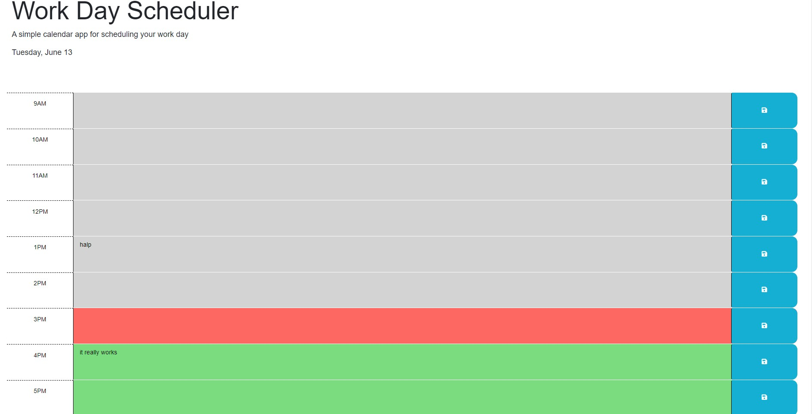

# Calendar App

## Description

I finished this app because I wanted to relearn my front-end programming skills. This app uses jQuery specific code, which could be useful with certain employers. It allows the user to keep track of things that they have to do in a business day. Additionally it color codes the blocks by past, present and future.

## Installation

There are no required installations.

## Usage

Simply type into the text boxes, and click the save button to have the program re-enter the values on refresh.

